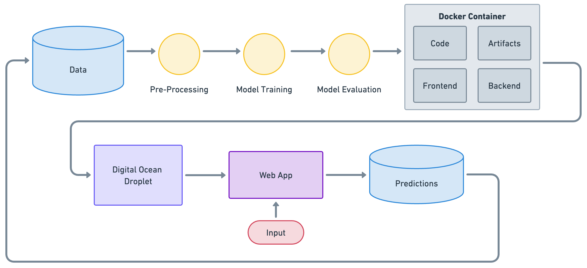

# Predictive Maintenance Web Application

## Overview

This repository contains the code and resources for a web application designed for predictive maintenance. The application leverages machine learning models to predict equipment failures and classify failure types based on process parameters like air and process temperatures, rotational speed, torque, and tool wear.

## Motivation

The purpose of this application is to help companies reduce downtime, decrease repair costs, and enhance operational efficiency by providing real-time insights into equipment performance. This enables proactive maintenance and minimizes unplanned downtime.

## Success Metrics

- **Model Performance:** Precision, recall, and F1 score of the predictive models.
- **Usability:** Responsiveness and ease of use of the web application.
- **Operational Impact:** Reduction in unplanned downtime and repair costs.

## Requirements

### Functional Requirements

- Users can input process parameters to receive predictions on equipment failure and its type.
- Users can view and compare performance metrics of different machine learning models.
- The application provides data visualization for equipment behavior insights.

### Non-functional Requirements

- High precision, recall, and F1 score for the model.
- Responsive and user-friendly web application interface.
- Secure handling and protection of user data.

### Constraints

- Development using FastAPI and Streamlit.
- Deployment via Docker and hosted on Digital Ocean droplets.
- Minimal deployment costs.

### Out-of-scope

- Integration with external applications or data sources.
- Detailed equipment diagnostic information.

## Methodology

### Problem Statement

Developing a machine learning model to predict equipment failures based on process parameters.

### Data

Utilizes a dataset with over 50,000 data points, featuring 14 columns of process parameters and a binary target variable indicating equipment failure.

### Techniques

- Data preprocessing and cleaning.
- Feature engineering and selection.
- Model training and hyperparameter tuning.
- Model evaluation and testing.

## Architecture

- **Frontend:** Built using Streamlit.
- **Backend:** Developed with FastAPI.
- **Machine Learning Model:** For predicting equipment failures.
- **Docker:** Containers to encapsulate frontend, backend, and model.
- **Hosting:** Digital Ocean droplets.
- **CI/CD:** Automated deployment using GitHub Actions.

## Deployment

The application is deployed on a DigitalOcean droplet, ensuring scalable and reliable hosting. The entire deployment process is containerized using Docker, ensuring consistency across different environments.

## Conclusion

This README outlines the structure and functionality of the predictive maintenance web application designed to utilize advanced machine learning techniques for predicting equipment failures and enhancing maintenance strategies.
